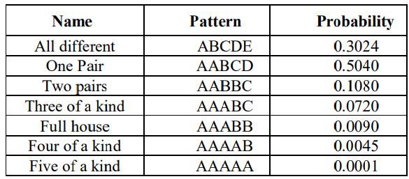
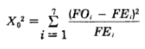
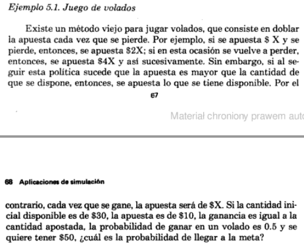
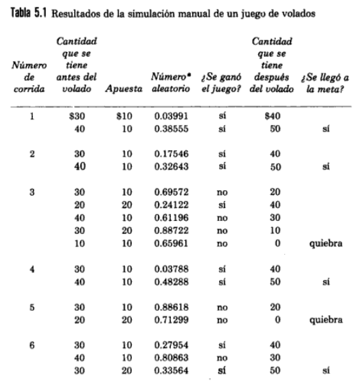
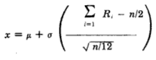
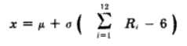
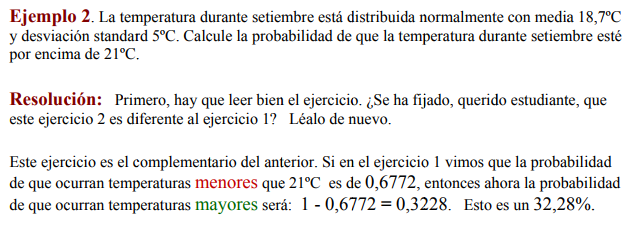

# Códigos en simulación

## Prueba poker

Esta prueba es similar a la prueba de frecuencias sin embargo, aquí se cuentan los números con 5 dígitos decimales que sigan los siguientes patrones:



Sabiendo que la frecuencia observada es aquella que se consigue al contar y que la frecuencia esperada para cada patrón es `probabilidad de patrón x * numero de datos`. Con esto se calcula el `X^2` así:



Y si este valor es inferior a `7.81`, no se puede rechazar la hipótesis que los números provienen de una distribución uniforme.

[Explicacion del libro](Poker.png).

Para encapsular la lógica de detectar que tipo de mano es un número en particular, se creó el modulo `manos.py`. De este se hará uso primordial al método `tipo(numero)` donde `numero` es un `string`; Y de la variable probabilidad.

```python
# manos.py
"""
td - todos diferentes
1p - 1 par
2p - 2 pares
tercia - 3 iguales
full - 1 trio y 1 par
poker - 4 iguales
quintilla - todos iguales
"""
probabilidad = {'td':0.30240, '1p':0.50400, '2p':0.10800, 'tercia':0.07200, 'full':0.00900, 'poker':0.00450, 'quintilla':0.00010}
def quintilla(numero):
    digito1 = numero[0]
    for digito in numero:
        if digito != digito1:
            return False
    return True
def full(numero):
    # Conteo
    guia = dict.fromkeys(numero, 0)
    for digito in numero:
        guia[digito]+=1
    if(2 in guia.values() and 3 in guia.values()):
        return True
    return False
def poker(numero):
    if(tercia(numero)):
        # Conteo
        guia = dict.fromkeys(numero, 0)
        for digito in numero:
            guia[digito]+=1
        for conteo in guia.values():
            if conteo >= 4:
                return True
        return False
    else:
        return False
def tercia(numero):
    # Conteo
    guia = dict.fromkeys(numero, 0)
    for digito in numero:
        guia[digito]+=1
    # Impar
    for conteo in guia.values():
        if conteo >= 3:
            return True
    return False
def onep(numero):
    # Conteo
    guia = dict.fromkeys(numero, 0)
    for digito in numero:
        guia[digito]+=1
    # Par
    for conteo in guia.values():
        if conteo >= 2:
            return True
    return False
def twop(numero):
    # Conteo
    guia = dict.fromkeys(numero, 0)
    for digito in numero:
        guia[digito]+=1
    # Primer par
    # Solo si sabemos que había uno
    if onep(numero):
        par = None
        for conteo in guia.items():
            if conteo[1] >= 2:
                par = conteo[0]
                break
        # Quitamos el que había
        del guia[par]
        # Segundo par
        for conteo in guia.values():
            if conteo >= 2:
                return True
        return False
    else:
        return False
def td(numero):
    return not (len(numero) != len(set(numero)))
def tipo(numero):
    if quintilla(numero):
        return 'quintilla'
    elif poker(numero):
        return 'poker'
    elif full(numero):
        return 'full'
    elif tercia(numero):
        return 'tercia'
    elif twop(numero):
        return '2p'
    elif onep(numero):
        return '1p'
    else:
        return 'td'
```
Como prueba se proveen los archivos `numeros-poker.txt` y `numeros-poker-2.txt` los cuales contienen 100 mil números cada uno de la siguiente forma:
```
0.9040738351136421
0.8871326759650664
0.799542640430318
0.7920153165078209
0.020045744228985196
...
..
.
```
En el archivo `poker.py` se cargan los números a probar desde archivos de texto así:
```python
# poker.py
import manos

# Nivel de verbose
entrada = input("Desea ver todos los detalles?(Y/N) >")
IMPRIMIR = (entrada == 'Y' or entrada == 'y')
# Leyendo números
numeros = []
ruta = "numeros-poker.txt"
# ruta = "numeros-poker-2.txt"
with open(ruta, "r") as archivo:
    for linea in archivo:
        numeros.append(linea[2:7])
    archivo.close()

# Mostrando números
if IMPRIMIR:
  print(numeros)
```
Según la entrada del usuario (Y/N) se mostraran los números en la salida. A continuación se haya la frecuencia observada y la frecuencia esperada así:
```python
# Frecuencia observada
fo = {'td':0, '1p':0, '2p':0, 'tercia':0, 'full':0, 'poker':0, 'quintilla':0}
# Frecuencia esperada
fe = {'td':0, '1p':0, '2p':0, 'tercia':0, 'full':0, 'poker':0, 'quintilla':0}
# Calculando frecuencia esperada
for tipo_mano in fe.keys():
    fe[tipo_mano] = len(numeros) * manos.probabilidad[tipo_mano]

# Contando la frecuencia observada
for numero in numeros:
    fo[manos.tipo(numero)] += 1
    if IMPRIMIR:
        print("#", numero)
        print("quintilla:", manos.quintilla(numero))
        print("poker:", manos.poker(numero))
        print("full:", manos.full(numero))
        print("tercia:", manos.tercia(numero))
        print("2p:", manos.twop(numero))
        print("1p:", manos.onep(numero))
        print("td:", manos.td(numero))
        print("-"*5)
```
Un ejemplo de la salida en caso que `IMPRIMIR = True` seria:
```shell
.
..
...
# 52806
quintilla: False
poker: False
full: False
tercia: False
2p: False
1p: False
td: True
-----
# 38412
quintilla: False
poker: False
full: False
tercia: False
2p: False
1p: False
td: True
...
..
.
```
- `td` todos diferentes
- `1p` 1 par
- `2p` 2 pares
- `tercia` 3 iguales
- `full` 1 trio y 1 par
- `poker` 4 iguales
- `quintilla` todos iguales
Luego se calcula el `X^2` y se da el resultado así:
```python
# Mostrar la frecuencia esperada y observada obtenida
if IMPRIMIR:
    print("#"*5, "Frecuencias", "#"*5)
    print(fe, "=", sum(fe.values()))
    print(fo, "=", sum(fo.values()))

# Calculando X^2
sum = 0.0
for tipo_mano in fe.keys():
    sum += ((fo[tipo_mano]-fe[tipo_mano])**2)/fe[tipo_mano]

# Resultado
print(sum, "< 7.81")
if sum < 7.81:
    print("No se rechaza que los números siguen una distribución uniforme")
else:
    print("Se rechaza que los números siguen una distribución uniforme")
```
Un ejemplo de la salida en caso que `IMPRIMIR = True` seria:
```shell
##### Frecuencias #####
{'td': 30240.0, '1p': 50400.0, '2p': 10800.0, 'tercia': 7199.999999999999, 'full': 899.9999999999999, 'poker': 449.99999999999994, 'quintilla': 10.0} = 100000.0
{'td': 30388, '1p': 50312, '2p': 10959, 'tercia': 7009, 'full': 876, 'poker': 450, 'quintilla': 6} = 100000
10.525628306878252 < 7.81
Se rechaza que los números siguen una distribución uniforme
```

## Volados

Esta juego esta explicado de la siguiente forma:



Un ejemplo de la simulación es el siguiente:



En este caso una corrida acaba cuando el saldo llega a 50 o 0. Una corrida esta dada por lo siguiente:
```python
import random
# INICIO Corrida
saldo = 30
apuesta = 10
print("[#] Si  A  R  = Sf")
n_lanzamiento = 1
while saldo > 0 and saldo != 50:
    print("[" + str(n_lanzamiento) + "]", saldo, apuesta, end="")
    if random.uniform(0, 1) < 0.5:
        # Gana
        print(" G ", end="")
        saldo += apuesta
        apuesta = 10
    else:
        # Pierde
        print(" P ", end="")
        saldo -= apuesta
        apuesta *= 2 # Apuesta el doble cuando pierde
        if apuesta >= saldo: apuesta = saldo
    print(" = " + str(saldo))
    n_lanzamiento += 1
# FIN Corrida
```
Esto puede dar como salida:
```shell
[#] Si A  R  = Sf
[1] 30 10 G  = 40
[2] 40 10 P  = 30
[3] 30 20 P  = 10
[4] 10 10 P  = 0
Perdió
```
o
```shell
[#] Si A  R  = Sf
[1] 30 10 P  = 20
[2] 20 20 G  = 40
[3] 40 10 G  = 50
Ganó
```
- `[#]` Numero del lanzamiento.
- `Si` Saldo inicial.
- `A` Valor de la apuesta.
- `R` Si ganó `G` o perdió `P`.
- `Sf` Saldo final.

Haciendo lo anterior `n_corridas` y llevando la cuenta de cuantas veces ganó y perdió.
```python
n_corridas = 150
gana = 0 # Cuantas veces ganó
pierde = 0 # Cuantas veces perdió
for corrida in range(n_corridas):
    print("\nJuego #" + str(corrida + 1))
    # INICIO Corrida
    saldo # Tendra un valor de 0 ó >=50
    # FIN Corrida
    if saldo == 0:
        print("Perdio")
        pierde += 1
    else:
        print("Gano")
        gana += 1
print("\n% de Ganar",str("%.2f" % round(gana*100/(gana+pierde), 2)) + "%")
print("% de Perder",str("%.2f" % round(pierde*100/(gana+pierde), 2)) + "%")
```
Se obtiene una salida como esta (`n_corridas = 10`):
```shell
Juego #1
[#] Si A  R  = Sf
[1] 30 10 P  = 20
[2] 20 20 P  = 0
Perdió

Juego #2
[#] Si A  R  = Sf
[1] 30 10 P  = 20
[2] 20 20 P  = 0
Perdió

Juego #3
[#] Si A  R  = Sf
[1] 30 10 G  = 40
[2] 40 10 G  = 50
Ganó

Juego #4
[#] Si A  R  = Sf
[1] 30 10 G  = 40
[2] 40 10 P  = 30
[3] 30 20 G  = 50
Ganó

Juego #5
[#] Si A  R  = Sf
[1] 30 10 P  = 20
[2] 20 20 G  = 40
[3] 40 10 G  = 50
Ganó

Juego #6
[#] Si A  R  = Sf
[1] 30 10 P  = 20
[2] 20 20 G  = 40
[3] 40 10 G  = 50
Ganó

Juego #7
[#] Si A  R  = Sf
[1] 30 10 P  = 20
[2] 20 20 G  = 40
[3] 40 10 G  = 50
Ganó

Juego #8
[#] Si A  R  = Sf
[1] 30 10 G  = 40
[2] 40 10 G  = 50
Ganó

Juego #9
[#] Si A  R  = Sf
[1] 30 10 G  = 40
[2] 40 10 G  = 50
Ganó

Juego #10
[#] Si A  R  = Sf
[1] 30 10 G  = 40
[2] 40 10 G  = 50
Ganó

% de Ganar 80.00%
% de Perder 20.00%
```
Para ver el código completo, [click aqui](Volados.py).

## Procedimientos especiales (Dist Normal)

El procedimiento especial para generar una variable aleatoria `x`, con distribución normal con una media y desviación estándar en particular, es expresado con la siguiente ecuación:



Sin embargo, la bibliografía nos dice que esta demostrado para `n = 12` así que la ecuación queda así:



[Explicacion del libro](Normal.png).

### Lluvia



Del enunciado sabemos que la `MEDIA = 18.7` y que `DESV_ESTANDAR = 5`. Para generar una variable aleatoria `x` usamos el siguiente método:
```python
import random
def var_aleatoria():
    MEDIA = 18.7
    DESV_ESTANDAR = 5.0
    sumatoria = 0.0
    for i in range(12):
        sumatoria += random.uniform(0, 1)
    return MEDIA + DESV_ESTANDAR*(sumatoria - 6.0)
```
En este caso, se ejecutaran `n_corridas` donde cada una estará dada por 30 variables aleatorias debido a que cada variable representa un día del mes. Un solo mes, lo mismo que una corrida, se ejecuta así:
```python
# resultado = Cuantas veces la temperatura estuvo > 21°C en 1 mes
resultado = 0
for dia in range(30):
    if(var_aleatoria() > 21.0):
        resultado += 1
```
De esta forma la probabilidad que la temperatura sea > de 21°C en ese mes es `resultado/30.0`. Esto ejecutado `n_corridas` seria:
```python
n_corridas = 5
resultado_final = 0 # Promedio de probabilidades que la temperatura > 21°C después de n_corridas
for corrida in range(n_corridas):
    # INICIO Corrida
    # resultado = Cuantas veces la temperatura estuvo > 21°C en 1 mes
    resultado # Tendrá un valor después de la corrida
    # FIN Corrida
    print("[" + str(corrida + 1) + "] Prob de T > 21°: "
        + str("%.2f" % round(resultado/30.0, 2)) + " en 30 días")
    resultado_final += resultado/30.0
print("P(T>21°C): " + str("%.2f" % round(resultado_final/n_corridas, 2)))
```
Esto da como salida:
```shell
[1] Prob de T > 21°: 0.33 en 30 días
[2] Prob de T > 21°: 0.37 en 30 días
[3] Prob de T > 21°: 0.40 en 30 días
[4] Prob de T > 21°: 0.50 en 30 días
[5] Prob de T > 21°: 0.43 en 30 días
P(T>21°C): 0.41
```
Para ver el código completo, [click aqui](Normal_Lluvia.py).

## Procedimientos especiales (Dist binomial)

El procedimiento especial para generar una variable aleatoria con distribución binomial puede ser expresado en una serie de pasos:
- Generar `n` números pseudo-aleatorios llamados `R`.
- Contar cuantos de estos `R` son menores que una probabilidad `P`
- La cantidad contada en el paso anterior es la variable aleatoria

[Explicacion del libro](Binomial.png).

### Alternadores


En este caso, se ejecutaran `n_corridas` donde cada una estará dada por `n = 10` alternadores debido a que se consultan 10. Mi probabilidad de que un alternador este defectuoso es de `P = 0.2`. Con esto, 1 corrida sera lo siguiente:
```python
import random
n_alternadores = 10
P = 0.2
n_defectuosos = 0
for alternador in range(n_alternadores):
    if random.uniform(0, 1) < P:
        n_defectuosos += 1
```
De esta forma `n_defectuosos` seria mi variable aleatoria. Haciendo el código anterior múltiples veces y sacando las probabilidades para las preguntas seria así:
```python
n_corridas = 50
"""
resultado_0 = Pregunta a. Cuantas veces no hubieron defectuosos
resultado_1 = Pregunta b. Cuantas veces solo uno salio defectuoso
resultado_2 = Pregunta c. Cuantas veces salieron al menos 2 defectuosos
resultado_3 = Pregunta d. Cuantas veces salieron mas de 3 defectuosos
resultado_4 = Pregunta e. Cuantas veces no mas de 3 salieron defectuosos
"""
resultado_0 = 0
resultado_1 = 0
resultado_2 = 0
resultado_3 = 0
resultado_4 = 0

for corrida in range(n_corridas):
    # CORRIDA Código anterior
    n_defectuosos # Tendrá un valor después de la corrida
    # Conteo para probabilidades
    if n_defectuosos == 0: resultado_0 += 1
    if n_defectuosos == 1: resultado_1 += 1
    if n_defectuosos >= 2: resultado_2 += 1
    if n_defectuosos > 3: resultado_3 += 1
    if n_defectuosos <= 3: resultado_4 += 1
print("P(X=0):", resultado_0/n_corridas)
print("P(X=1):", resultado_1/n_corridas)
print("P(X>=2):", resultado_2/n_corridas)
print("P(X>3):", resultado_3/n_corridas)
print("P(X<=3):", resultado_4/n_corridas)
```
Esto da como salida:
```shell
P(X=0): 0.18
P(X=1): 0.3
P(X>=2): 0.52
P(X>3): 0.2
P(X<=3): 0.8
```
Para ver el código completo, [click aqui](Binomial_Alternadores.py).

### Dados

__¿Cual es la probabilidad de obtener 20 veces el numero 3 al lanzar 51 veces un dado?__

En este caso `n = 51` debido a que una corrida corresponderá a 51 lanzamientos. La probabilidad de sacar 3 en un dado es `P = 1/6`. Una corrida esta expresada de la siguiente forma:
```python
import random
n_lanzamientos = 51
P = 1.0/6.0
numero_3es = 0
for lanzamiento in range(n_lanzamientos):
    R = random.uniform(0, 1)
    if R < P:
        numero_3es += 1.0
print("51 Lanzamientos con", numero_3es, "3es")
```
De esta forma `numero_3es` sera mi variable aleatoria. Haciendo el código anterior múltiples veces y sacando la probabilidad para responder la pregunta seria así:
```python
n_corridas = 50
respuesta = 0.0 # Cuantas veces se obtuvieron 20 veces el numero 3 luego de n_lanzamientos 
for corrida in range(n_corridas):
    # INICIO Corrida
    numero_3es # Tendrá un valor después de la corrida
    # FIN Corrida
    # Conteo para probabilidad
    if numero_3es == 20: respuesta += 1.0
print("P(X=20):", respuesta/n_corridas)
```
Esto da como salida:
```shell
51 Lanzamientos con 7.0 3es
51 Lanzamientos con 11.0 3es
51 Lanzamientos con 9.0 3es
51 Lanzamientos con 5.0 3es
51 Lanzamientos con 8.0 3es
51 Lanzamientos con 8.0 3es
51 Lanzamientos con 6.0 3es
51 Lanzamientos con 7.0 3es
51 Lanzamientos con 6.0 3es
51 Lanzamientos con 9.0 3es
51 Lanzamientos con 6.0 3es
51 Lanzamientos con 7.0 3es
51 Lanzamientos con 9.0 3es
51 Lanzamientos con 11.0 3es
51 Lanzamientos con 8.0 3es
51 Lanzamientos con 12.0 3es
51 Lanzamientos con 4.0 3es
51 Lanzamientos con 11.0 3es
51 Lanzamientos con 10.0 3es
51 Lanzamientos con 8.0 3es
51 Lanzamientos con 3.0 3es
51 Lanzamientos con 6.0 3es
51 Lanzamientos con 9.0 3es
51 Lanzamientos con 8.0 3es
51 Lanzamientos con 7.0 3es
51 Lanzamientos con 11.0 3es
51 Lanzamientos con 8.0 3es
51 Lanzamientos con 9.0 3es
51 Lanzamientos con 12.0 3es
51 Lanzamientos con 5.0 3es
51 Lanzamientos con 5.0 3es
51 Lanzamientos con 11.0 3es
51 Lanzamientos con 7.0 3es
51 Lanzamientos con 6.0 3es
51 Lanzamientos con 9.0 3es
51 Lanzamientos con 12.0 3es
51 Lanzamientos con 10.0 3es
51 Lanzamientos con 4.0 3es
51 Lanzamientos con 8.0 3es
51 Lanzamientos con 12.0 3es
51 Lanzamientos con 7.0 3es
51 Lanzamientos con 14.0 3es
51 Lanzamientos con 8.0 3es
51 Lanzamientos con 13.0 3es
51 Lanzamientos con 7.0 3es
51 Lanzamientos con 4.0 3es
51 Lanzamientos con 11.0 3es
51 Lanzamientos con 8.0 3es
51 Lanzamientos con 10.0 3es
51 Lanzamientos con 13.0 3es
P(X=20): 0.0
```
Para ver el cogido completo, [click aqui](Binomial_Dados.py).
