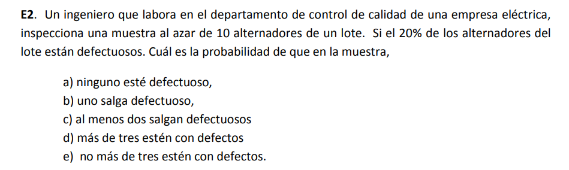

# Codigos en simulacion

## Prueba poker

## Volados

## Procedimientos especiales (Dist Normal)

Lluvia

## Procedimientos especiales (Dist binomial)

El procedimiento especial para generar una variable aleatoria con distribucion binomial puede ser expresado en una serie de pasos:
- Generar `n` numeros presudo-aleatorios llamados `R`.
- Contar cuantos de estos `R` son menores que una probabilidad `P`
- La cantidad contada en el paso anterior es la variable aleatoria

[Explicacion del libro](Binomial.png)

### Alternadores



En este caso, se ejecutaran `n_corridas` donde cada una estará dada por `n=10` alternadores debido a que se consultan 10. Mi probabilidad de que un alternador este defectuoso es de `P=0.2`. Con esto, 1 corrida sera lo siguiente:
```python
import random
n_alternadores = 10
P = 0.2
n_defectuosos = 0
for alternador in range(n_alternadores):
    if random.random() < P:
        n_defectuosos += 1
```
De esta forma `n_defectuosos` seria mi variable aleatoria. Haciendo el codigo anterior multiples veces y sacando las probabilidades para las preguntas seria así:
```python
n_corridas = 50
"""
resultado_0 = Pregunta a. Cuantas veces no hubieron defectuosos
resultado_1 = Pregunta b. Cuantas veces solo uno salio defectuoso
resultado_2 = Pregunta c. Cuantas veces salieron al menos 2 defectuosos
resultado_3 = Pregunta d. Cuantas veces salieron mas de 3 defectuosos
resultado_4 = Pregunta e. Cuantas veces no mas de 3 salieron defectuosos
"""
resultado_0 = 0
resultado_1 = 0
resultado_2 = 0
resultado_3 = 0
resultado_4 = 0

for corrida in range(n_corridas):
    # CORRIDA Codigo anterior
    n_defectuosos # Tendra un valor despues de la corrida
    # Conteo para probabilidades
    if n_defectuosos == 0: resultado_0 += 1
    if n_defectuosos == 1: resultado_1 += 1
    if n_defectuosos >= 2: resultado_2 += 1
    if n_defectuosos > 3: resultado_3 += 1
    if n_defectuosos <= 3: resultado_4 += 1
print("P(X=0):", resultado_0/n_corridas)
print("P(X=1):", resultado_1/n_corridas)
print("P(X>=2):", resultado_2/n_corridas)
print("P(X>3):", resultado_3/n_corridas)
print("P(X<=3):", resultado_4/n_corridas)
```
Esto da como salida:
```shell
P(X=0): 0.18
P(X=1): 0.3
P(X>=2): 0.52
P(X>3): 0.2
P(X<=3): 0.8
```
Para ver el codigo completo, [click aqui](Binomial_Alternadores.py).

### Dados

__¿Cual es la probabilidad de obtener 20 veces el numero 3 al lanzar 51 veces un dado?__

En este caso `n=51` debido a que una corrida correspondera a 51 lanzamientos. La probabilidad de sacar 3 un dado es `P=1/6`. Una corrida esta expresada de la siguiente forma:
```python
import random
n_lanzamientos = 51
P = 1.0/6.0
numero_3es = 0
for lanzamiento in range(n_lanzamientos):
    R = random.random()
    if R < P:
        numero_3es += 1.0
print("51 Lanzamientos con", numero_3es, "3es")
```
De esta forma `numero_3es` sera mi variable aleatoria. Haciendo el codigo anterior multiples veces y sacando la probabilidad para responder la pregunta seria así:
```python
n_corridas = 50
respuesta = 0.0 # Cuantas veces se obtuvieron 20 veces el numero 3 luego de n_lanzamientos 
for corrida in range(n_corridas):
    # INICIO Corrida
    numero_3es # Tendra un valor despues de la corrida
    # FIN Corrida
    # Conteo para probabilidad
    if numero_3es == 20: respuesta += 1.0
print("P(X=20):", respuesta/n_corridas)
```
Esto da como salida:
```shell
51 Lanzamientos con 7.0 3es
51 Lanzamientos con 11.0 3es
51 Lanzamientos con 9.0 3es
51 Lanzamientos con 5.0 3es
51 Lanzamientos con 8.0 3es
51 Lanzamientos con 8.0 3es
51 Lanzamientos con 6.0 3es
51 Lanzamientos con 7.0 3es
51 Lanzamientos con 6.0 3es
51 Lanzamientos con 9.0 3es
51 Lanzamientos con 6.0 3es
51 Lanzamientos con 7.0 3es
51 Lanzamientos con 9.0 3es
51 Lanzamientos con 11.0 3es
51 Lanzamientos con 8.0 3es
51 Lanzamientos con 12.0 3es
51 Lanzamientos con 4.0 3es
51 Lanzamientos con 11.0 3es
51 Lanzamientos con 10.0 3es
51 Lanzamientos con 8.0 3es
51 Lanzamientos con 3.0 3es
51 Lanzamientos con 6.0 3es
51 Lanzamientos con 9.0 3es
51 Lanzamientos con 8.0 3es
51 Lanzamientos con 7.0 3es
51 Lanzamientos con 11.0 3es
51 Lanzamientos con 8.0 3es
51 Lanzamientos con 9.0 3es
51 Lanzamientos con 12.0 3es
51 Lanzamientos con 5.0 3es
51 Lanzamientos con 5.0 3es
51 Lanzamientos con 11.0 3es
51 Lanzamientos con 7.0 3es
51 Lanzamientos con 6.0 3es
51 Lanzamientos con 9.0 3es
51 Lanzamientos con 12.0 3es
51 Lanzamientos con 10.0 3es
51 Lanzamientos con 4.0 3es
51 Lanzamientos con 8.0 3es
51 Lanzamientos con 12.0 3es
51 Lanzamientos con 7.0 3es
51 Lanzamientos con 14.0 3es
51 Lanzamientos con 8.0 3es
51 Lanzamientos con 13.0 3es
51 Lanzamientos con 7.0 3es
51 Lanzamientos con 4.0 3es
51 Lanzamientos con 11.0 3es
51 Lanzamientos con 8.0 3es
51 Lanzamientos con 10.0 3es
51 Lanzamientos con 13.0 3es
P(X=20): 0.0
```
Para ver el codigo completo, [click aqui](Binomial_Dados.py).